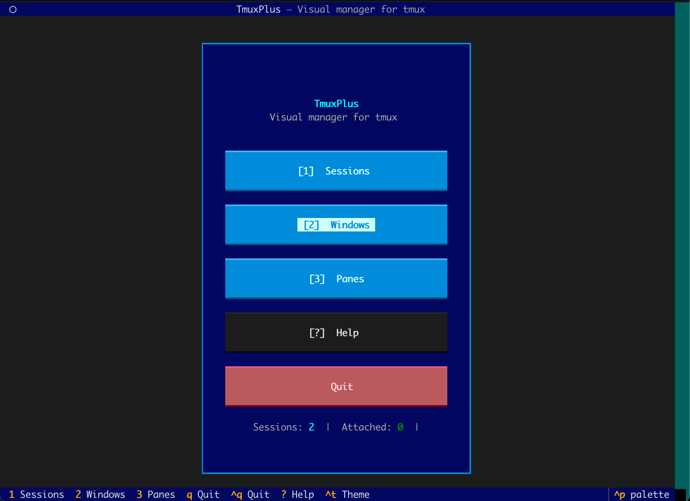

# TmuxPlus

Gerenciador visual TUI para **tmux**, construído com [Textual](https://textual.textualize.io/) e [libtmux](https://libtmux.git-pull.com/).




> **[Read in English](README.md)**

## Funcionalidades

- Gerenciamento completo de **sessões**, **janelas** e **painéis** tmux
- Salvar e restaurar layouts de sessões (persistência em JSON)
- Paleta de comandos (Ctrl+P) para acesso rápido
- Temas alternáveis (Ctrl+T) — Dracula, Monokai, Gruvbox, Nord, Tokyo Night e mais
- Interface em português (pt-BR) com suporte a internacionalização
- Reconexão automática — ao sair do attach (Ctrl+B, D), o TmuxPlus reabre

## Instalação

### Rápida

```bash
bash install.sh
```

### Manual

```bash
git clone https://github.com/megamvb/TmuxPlus.git
cd TmuxPlus
pip install -r requirements.txt
python3 main.py
```

## Dependências

- Python 3.10+
- tmux
- [textual](https://pypi.org/project/textual/) >= 0.50.0
- [libtmux](https://pypi.org/project/libtmux/) >= 0.25.0

## Uso

```bash
python3 main.py          # iniciar
python3 main.py --log    # iniciar com log em arquivo
```

### Atalhos principais

| Tecla      | Ação                    |
|------------|-------------------------|
| `Ctrl+Q`   | Sair                   |
| `Ctrl+T`   | Alternar tema          |
| `?`         | Ajuda                  |
| `Ctrl+P`   | Paleta de comandos     |

## Estrutura do projeto

```
TmuxPlus/
├── main.py                # Ponto de entrada — loop de attach/detach
├── app.py                 # App Textual, paleta de comandos, temas
├── screens/               # Telas (Home, Sessions, Windows, Panes, Help)
├── services/              # TmuxService — operações tmux via libtmux
├── widgets/               # Widgets customizados
├── styles/app.tcss        # CSS Textual
├── i18n/                  # Internacionalização
├── install.sh             # Script de instalação
└── requirements.txt
```

## Licença

[MIT](LICENSE)
